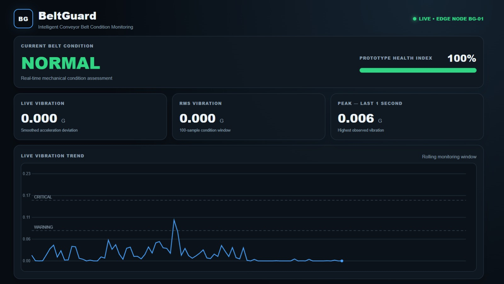
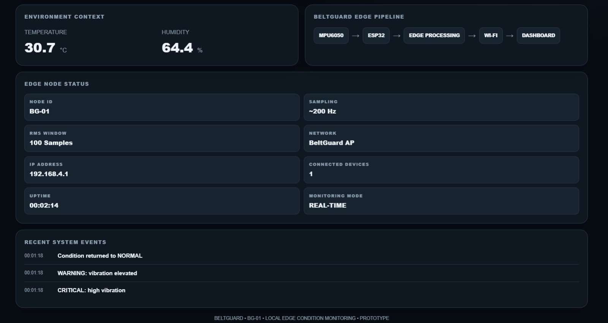
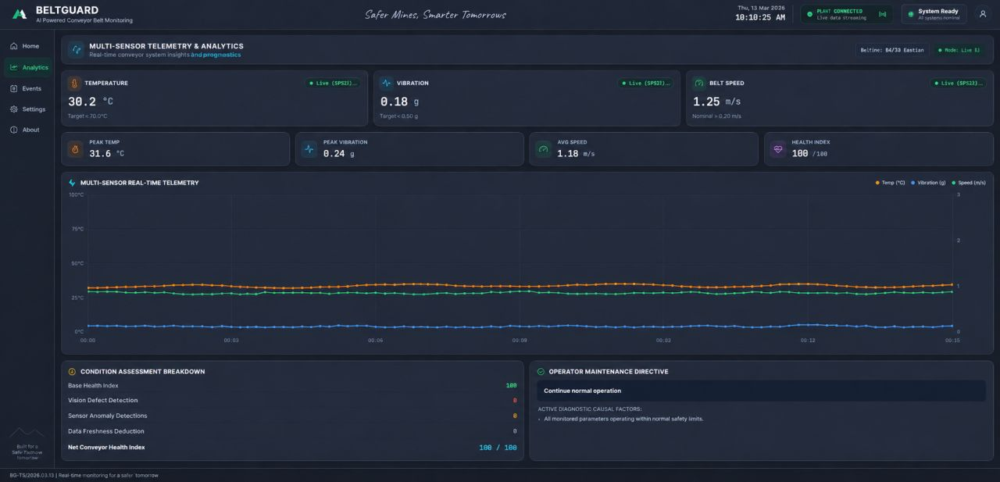
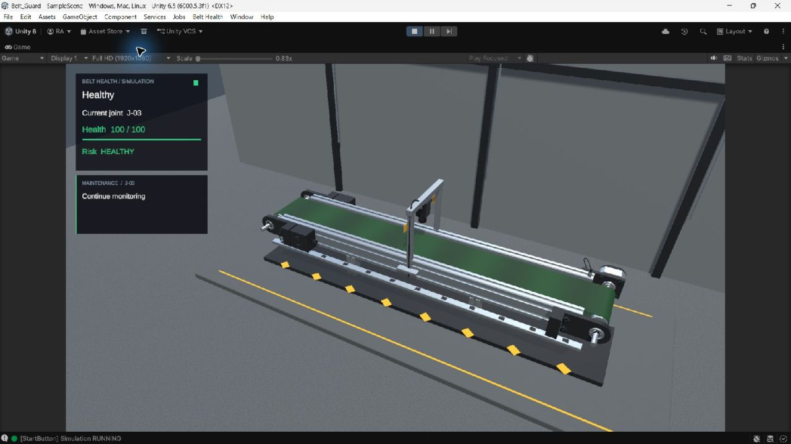
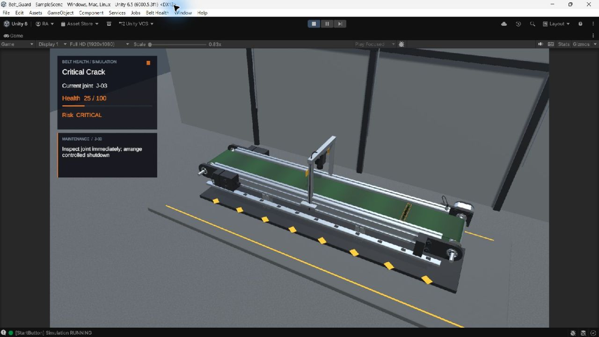

# BeltGuard

Intelligent Conveyor Belt Joint Condition Monitoring & Digital Twin

**SIH26008 | Ministry of Steel | NMDC**

## Problem Statement

Conveyor joints and splices can degrade under vibration, load, wear, misalignment, temperature and mechanical stress. Periodic manual inspection may miss early changes. BeltGuard explores continuous condition monitoring through a student engineering prototype.

## Proposed Solution

BeltGuard combines embedded condition sensing, an ESP32 edge node, vibration analysis, OpenCV/YOLO vision, local dashboards, condition alerts and a Unity Digital Twin demonstrator. The supplied modules demonstrate different parts of this approach; they are not a proven end-to-end industrial installation.

## System Architecture

```text
MPU6050 + DHT22 -> ESP32 processing -> OLED + ESP32-hosted web dashboard
                                         (Wi-Fi SoftAP / HTTP)

Camera -> OpenCV + YOLO -> standalone annotated preview
       -> dashboard Python backend -> HTTP video/status + MQTT vision
                                   -> React dashboard
External MQTT sensor publisher ----> React dashboard (publisher not supplied)

Keyboard scenarios / Python UDP simulator -> Unity conveyor + joint health view
Python dictionary bridge -----------------> Unity localhost UDP input
                 (physical-system adapters remain to be integrated)
```

These are parallel prototype paths. The supplied ESP32 sketch does not publish MQTT, and no complete adapter connects it to the React dashboard or Unity. See [architecture notes](docs/architecture/README.md).

## Core Modules

### Embedded Monitoring

ESP32 firmware reads MPU6050 motion and DHT22 ambient temperature/humidity, computes vibration indicators and a heuristic health index, and serves a condition dashboard. An SSD1306 OLED displays local status.

### AI Vision

Python scripts use Ultralytics YOLO and OpenCV to annotate camera frames or an image. The checkpoint metadata lists Large hole, Large tear, Small Tear and Small hole classes. This is visual damage detection, not a demonstrated joint-localization or remaining-life model.

### Dashboard

React/TypeScript with Vite provides the main interface. A Flask backend runs camera inference, streams frames and publishes vision messages through MQTT. The browser subscribes to MQTT telemetry. Health scores and alerts are prototype rules. This is separate from the ESP32-hosted vibration dashboard shown below.

### Digital Twin

Unity provides a **scenario-based Digital Twin demonstrator** with conveyor motion, joint health, damage visualization and maintenance-state displays. Keyboard scenarios and a Python localhost UDP simulator drive it. A dictionary-to-UDP bridge is supplied, but this does not establish a live physical-system connection.

### Model Training

The supplied Google Colab link identifies the training workflow. The actual notebook was not available for export during preparation; no training metrics are claimed.

## Repository Structure

```text
BeltGuard-GitHub/
|-- README.md
|-- LICENSE                         # license-status notice, not an MIT grant
|-- .gitignore
|-- firmware/
|   |-- SIH_FINAL_CODE_3/SIH_FINAL_CODE_3.ino
|   `-- README.md
|-- ai-vision/
|   |-- src/                        # camera, image and model inspection scripts
|   |-- models/best.pt
|   |-- requirements.txt
|   `-- README.md
|-- dashboard/
|   |-- src/ + public/ + tests/
|   |-- backend/                    # Flask, vision and MQTT source
|   |-- models/best.pt              # dashboard's own supplied checkpoint
|   |-- package.json + package-lock.json
|   |-- index.html + build configuration
|   |-- .env.example
|   `-- README.md
|-- digital-twin/
|   |-- Assets/ + Packages/ + ProjectSettings/
|   |-- Tools/
|   |-- CP VS CODE/                 # two bridge/simulator scripts; path retained
|   `-- README.md
|-- training/README.md
|-- hardware/
|   |-- README.md
|   `-- components.md
`-- docs/
    |-- screenshots/
    |-- architecture/README.md
    |-- THIRD_PARTY_NOTICES.md
    |-- PREPARATION_REPORT.md
    `-- source-manifest.json
```

## Hardware

Confirmed by the main firmware: ESP32, MPU6050, DHT22 and SSD1306 128x64 OLED. Vision uses a camera through OpenCV; its make and model are unspecified. See [wiring and components](hardware/components.md). Motor-current, encoder and other fields in Unity scenarios do not establish that those physical sensors were supplied.

## Software Stack

Arduino/ESP32 C++, Python, OpenCV, Ultralytics YOLO, Flask, NumPy, Paho MQTT, Mosquitto configuration, React, TypeScript, Vite, Tailwind CSS, Recharts and Unity/C#. Unity project version: **6000.5.3f1**.

## Model Training

[BeltGuard YOLO Training — Google Colab](https://colab.research.google.com/drive/1ieZcrt0o-T-bfm4A08hkzcK6tWF9IGK7?usp=sharing).

The AI checkpoint is **5,474,010 bytes (5.22 MiB)**. The dashboard checkpoint is **5,460,299 bytes (5.21 MiB)** and differs from it. Both are preserved in their module's `models/` directory. No Git LFS is needed for these files. See [training notes](training/README.md).

## Demo / Screenshots

Supplied screenshots of the ESP32 dashboard, main dashboard and Unity demonstrator. These are visual references, not independent validation of sensor accuracy, live integration or industrial performance.





Main-dashboard analytics reference (the source of displayed telemetry has not been verified):



Unity scenario-based Digital Twin demonstrator — healthy and critical-crack scenarios:





[All supplied reference images, including the additional edge-dashboard JPEGs](docs/screenshots/README.md).

## Running the Project

1. **Firmware:** open `firmware/SIH_FINAL_CODE_3/SIH_FINAL_CODE_3.ino` in Arduino IDE, configure local Wi-Fi placeholders, install the documented libraries, select your ESP32 board and upload. See [firmware instructions](firmware/README.md).
2. **AI/OpenCV:** in `ai-vision`, create/activate a Python environment, run `python -m pip install -r requirements.txt`, then `python src/live_detection.py`. Default camera index is 2. See [AI instructions](ai-vision/README.md).
3. **Dashboard:** in `dashboard`, run `npm install` and `npm run dev`. Run the Python backend and MQTT services separately as documented in [dashboard instructions](dashboard/README.md). `npm run build` produces the frontend build.
4. **Unity:** add `digital-twin` in Unity Hub using 6000.5.3f1, open `Assets/Scenes/SampleScene.unity` and enter Play mode. See [controls and simulator instructions](digital-twin/README.md).

## Current Prototype Scope

BeltGuard currently demonstrates individual prototype layers. Unity is a **scenario-based Digital Twin demonstrator**, with localhost input support rather than a verified live industrial twin. The physical firmware's HTTP feed is not wired into the web dashboard's MQTT contract in the supplied source. Health/degradation scores and maintenance suggestions are heuristic or simulated, not validated predictive RUL. DHT22 measures ambient conditions; there is no verified thermal-camera implementation. Industrial validation, SCADA/PLC integration and fully synchronized operation are not established.

The frontend production build and five Python UDP simulator/bridge tests passed during preparation. Camera/model inference, firmware flashing and Unity Editor execution were not performed. See [validation and preparation report](docs/PREPARATION_REPORT.md).

## Future Scope

- Expand the sensor network and evaluate industrial edge hardware.
- Implement and test physical telemetry adapters across modules.
- Validate detection and thresholds against a representative field dataset.
- Investigate SCADA/PLC integration.
- Synchronize the Digital Twin with measured physical state.

## Licensing

A blanket MIT license has **not** been applied. Ultralytics software/model terms and Unity/font/sprite/CAD asset rights need to be considered before publication. Existing notices remain with their assets. See [license status](LICENSE) and [third-party inventory](docs/THIRD_PARTY_NOTICES.md).
